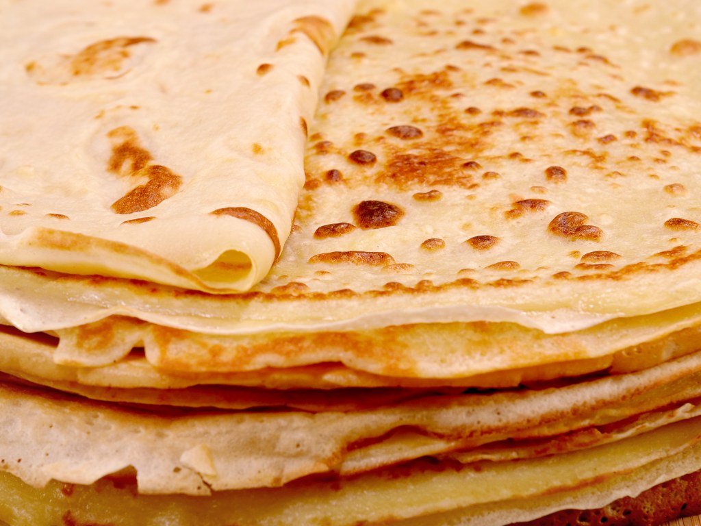

## MUSICAL PANCAKE RECIPE
___

<!--  -->

This is the recipe for the most crunchy, delicious, fabulous crêpe you will ever taste.
___

## INGREDIENTS

### Batter
* flour 
* eggs
* salt
* cream
* milk

### Filling
* nutella
* banana

### Tools
* One big bowl
* Whisk
___

## Steps
1. Whip flour and milk to a lump-free batter and then add and whip one egg at a time. Mix in the salt and let the batter sit for about 30 minutes.
2. Heat up a frying pan and put a little bit of butter for the first batch. The batter makes for 4 crêpes. Use approximately 1/2 dl for one crêpe.
3. Whip the cream and cut the banana into pieces.

## Serving instructions
1. Put the wipped cream, banana and the nutella inside the crêpe and fold it up.
2. Serve immediately (otherwise the cream will melt and lose its fluffiness).

## ENJOY!